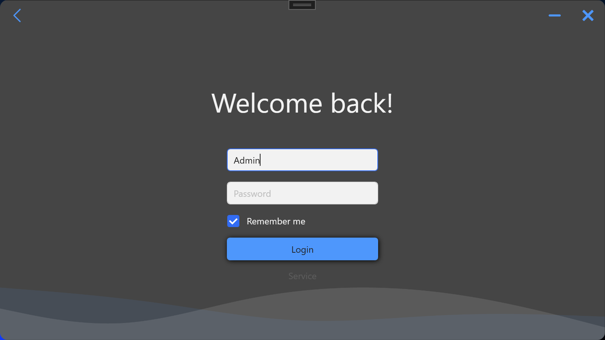

https://img.shields.io/github/repo-size/AlexStrew/DentalClinic
https://img.shields.io/tokei/lines/github/AlexStrew/DentalClinic
https://img.shields.io/github/languages/top/AlexStrew/DentalClinic

# АРМ DentalClinic🖋
The purpose of this program is to automate the workplace of a dentist at a clinic

> #### Disclaimer: Only works on Windows

# Features 🃏
- An application designed to automate the work of dental staff.

# Requirements 🎯
- Windows OS
- Have MySQL Database (5.6 or higher)

# How to use ✨
1. [Download the newest release.beta (.zip)](https://github.com/AlexStrew/DentalClinic/releases/latest) and extract
2. Go to DentalClinic/InstallerPackage/InstallerPackage-setupFiles/ and run **InstallerPackage.exe**. The program needs to be run as administrator to install
3. License key for test is **(1111-1111)**
4. In SSMS, create a database and name it ArmDental. Restore the database from the file **scriptARM.sql**

# Default login & pass 📈
admin : 1234

Feel free to open up issues for feature request, bugs, etc. or contribute.
